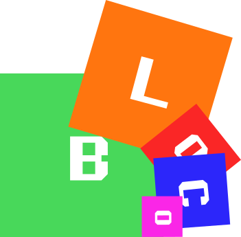

A tiny component-oriented game engine integrated with PixiJS gfx library. Uses <a href="https://github.com/parcel-bundler/parcel" target="_blank">Parcel bundler</a> for compilation and hot reload.

**Budget**: ~60 working hours so far

## Installation

Install <a href="https://www.npmjs.com/" target="_blank">NPM package manager</a> and write following commands:

```bash
npm install
npm start
```

Default listening port is `1234`. You can navigate to any `html` file that is inside `examples` folder, for instance `localhost:1234/rotation.html`.

`npm run-script start_no_map` will deploy the application without source maps (faster)
`npm run-script deploy` will minify all source files
`npm run-script tests` will run tests 

All files are deployed in `www` folder for development and in `dist` folder for release. Hot reload is executed automagically once you change any source file which makes the prototyping really comfortable. 

## Tests
For now, tests require a browser running. You can execute them via `npm run-script tests`. The browser should display a green background if the tests will succeed. Everything will be displayed in a console log.

Tests are located in `ts/tests/` directory.


## Example

Simple example that creates a rectangle along with 4 looped animations via `ChainingComponent`

```Typescript
let obj = new GameObjectBuilder("rect1")
		.withMesh(rectangleGfx)
		.withPosition(200, 200)
		.withCenteredOrigin()
		.withComponent(new ChainingComponent()
			.beginInterval(0)
			.addComponentAndWait(new TranslateAnimation(1, 1, 2, 1, 1)))
			.addComponentAndWait(new TranslateAnimation(2, 1, 2, 2, 1)))
			.addComponentAndWait(new TranslateAnimation(2, 2, 1, 2, 1)))
			.addComponentAndWait(new TranslateAnimation(1, 2, 1, 1, 1)))
			.endInterval()
        )
		.asGlobal()
		.build(engine.scene);
```